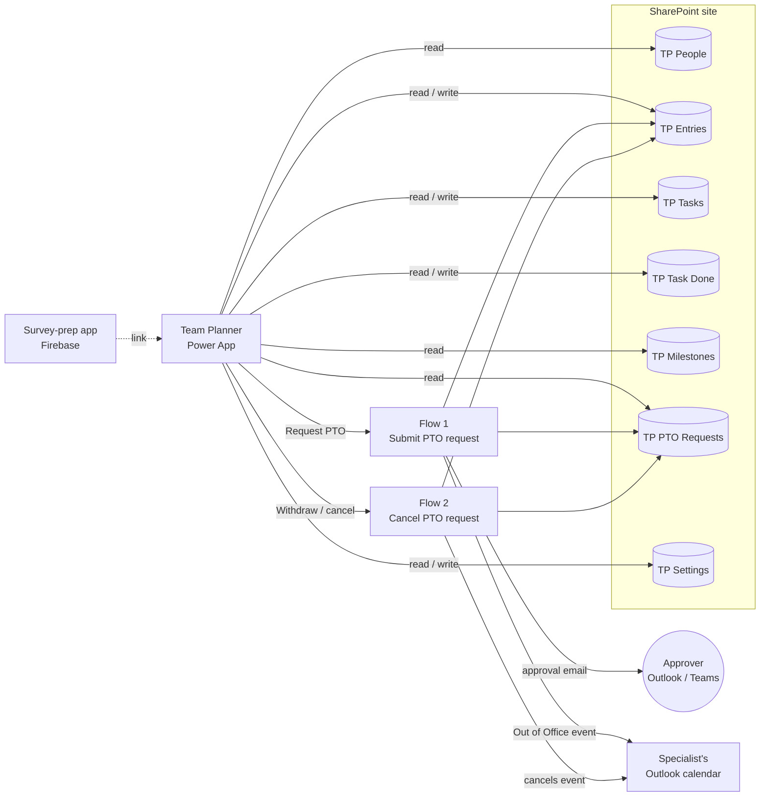

# Team Planner → SharePoint: migration plan

Proposal, 2026-10-08. [team-planner-source-analysis.md](team-planner-source-analysis.md)
covers how the planner got from the spreadsheet into Firestore. This document covers
moving it to SharePoint and adding a PTO approval process.

## 0. Decisions this plan is built on

These were settled in the planning conversation. If one changes, the sections listed
next to it change with it.

| Decision | Answer | Affects |
| --- | --- | --- |
| Access | SharePoint site owner and Power Automate. IT won't deploy custom code or register an Entra app. | §1 |
| Scope | The whole Team Planner, including Site Circuit. The survey-prep checklist stays on Firebase. | §3, §6 |
| PTO approver | Set per person on the roster | TP People `Approver` |
| Direct PTO entry | Still allowed alongside requests | §4, §5 |
| PTO features | Half days, cancelling approved PTO, pending requests shown on the calendar, an Outlook calendar event | §5 |
| Overlaps | The specialist chooses when submitting: replace what's already on those days, or keep both | §5 |

## 1. Recommendation

**Rebuild the planner as a Power Apps canvas app on SharePoint lists, and run PTO
approvals in Power Automate.**

| Option | How close to today | Needs IT? | Verdict |
| --- | --- | --- | --- |
| Port the React code into a SharePoint web part (SPFx) | Closest: same code | Yes. The package goes in an app catalog. | Not available |
| Keep the React app and store data in SharePoint via Microsoft Graph | Identical UI | Yes. Needs an Entra app registration. | Not available |
| **Power App + SharePoint lists + Power Automate** | Same views and workflows, different look | No | **Recommended** |
| SharePoint lists with calendar views only | Loses Today, My Tasks, Task Calendar and the print summaries | No | Loses too much |

This is the only option that keeps the planner working the way it does now with the
access available. If IT later approves an app registration, the React app could read
these same lists, so this doesn't rule that out.

**Licensing.** Everything here uses standard connectors (SharePoint, Approvals,
Office 365 Outlook, Office 365 Users), and those are covered by Microsoft 365
licenses. Avoid premium connectors such as HTTP, SQL, direct Dataverse or custom
connectors. A single premium action means everyone who runs that app or flow needs a
Premium license. Ask IT to confirm that the specialists' licenses include Power Apps;
most business and enterprise plans do.

**What the team will notice**

- **Same:** Today, My Tasks, Task Calendar, Whereabouts, Print Summary, the entry
  editor (including hotel and flight details), My Entries bulk delete, Roster, Site
  Circuit's leadership email, task tags and ticking tasks done.
- **Different:** they sign in with their Rotech Microsoft account, with no separate
  planner password. The planner opens from a link, a Teams tab or the SharePoint site.
  Controls look like Power Apps. Site Circuit sends through Outlook instead of opening
  a `mailto:` draft, so long emails are no longer cut off.
- **New:** Request PTO.
- **Replaced:** the `auditLog` collection. SharePoint version history records every
  change with who made it and when, and deleted items stay in the recycle bin for 93
  days.

## 2. How the pieces fit



## 3. SharePoint site and lists

Create one team site, for example "Accreditation Team Planner". **Before creating any
lists**, set Site settings → Regional settings → Time zone to the team's time zone.
Date-only columns are stored relative to that setting, and a wrong setting moves every
date by a day. The current app works around the same problem (see the DATES comment in
`src/teamPlannerData.js`).

Each list below replaces a Firestore collection. Index the columns shown in **bold**
(List settings → Indexed columns). Indexes keep filters fast and keep a list working
past SharePoint's 5,000-item view threshold. At about 1,000 entries a year, TP Entries
reaches that threshold in about five years.

**Why StartNum and EndNum exist.** Power Apps can't reliably pass a before/after date
filter to SharePoint. When it can't, it filters only the first 500–2,000 rows on the
device and silently misses the rest. The same comparison on a number column (yyyymmdd)
does get passed to SharePoint. The app writes both forms on every save, and the number
form isn't affected by time-zone shifts.

### TP People ← `teamPlannerPeople`

| Column | Type | Notes |
| --- | --- | --- |
| Title | Single line | Display name |
| **PersonKey** | Single line, enforce unique | `cody`, `tammy`, … Every other list refers to people by this. |
| Person | Person | Their Microsoft account. Replaces `email`. |
| Approver | Person | *New.* Who approves their PTO. Fill it in after import. |
| Admin | Yes/No | *New.* Replaces the hard-coded `PLANNER_ADMIN_EMAILS`. The export sets it from that list. |
| Active | Yes/No | |
| SortOrder | Number | Row order on the grids |
| Color | Single line | |
| SheetNames | Multiple lines | Spreadsheet spellings, kept for provenance |

### TP Entries ← `teamPlannerEntries`

| Column | Type | Notes |
| --- | --- | --- |
| Title | Single line | `Cody Landtroop · Site Visit · Searcy, AR`. Only for reading the list directly; the app doesn't use it. |
| LegacyId | Single line | Firestore document ID, for checking the import |
| **PersonKey** | Single line | Who the entry belongs to. The app checks edit rights against this. |
| PersonName | Single line | |
| OwnerEmail | Single line | Kept from Firestore for history. The app no longer checks it. |
| StartDate, EndDate | Date only | Inclusive, as today. A single day has StartDate = EndDate. |
| **StartNum**, **EndNum** | Number | *New.* Dates as yyyymmdd numbers, used for filtering |
| DayPart | Choice: Full day, AM, PM | *New.* Half-day PTO |
| **Status** | Choice | The nine labels below |
| RawText | Multiple lines | Original spreadsheet text |
| Notes | Multiple lines | |
| VisitLocation, VisitPurpose, VisitTime | Single line | |
| VisitMode | Choice: Onsite, Virtual | |
| VisitConfirmation | Choice: Scheduled, Confirmed, Needs reschedule | |
| TravelJson | Multiple lines, plain text | Hotel and flight details as one JSON object, same shape as today. Read with `ParseJSON()`, write with `JSON()`. |
| **RequestId** | Number | *New.* The TP PTO Requests item that created this entry. Blank for entries added directly. |
| LegacySource | Single line | For example `Cody!A38` |

**Status** choices use the labels the app already shows: Home Office, Site Visit,
Travel, PTO, Flex Holiday, Limited Availability, Meeting, Company Holiday, Other. The
app keeps a small table keyed by label for the short print codes (HOME, VISIT, TRVL,
PTO, FH, LTD, MTG, HOL) and colours. As in `STATUSES` today, these count as out of
office: Site Visit, Travel, PTO, Flex Holiday, Meeting and Company Holiday.

### TP Tasks ← `teamPlannerTasks`

| Column | Type | Notes |
| --- | --- | --- |
| Title | Single line | Task name |
| **TaskKey** | Single line, enforce unique | Firestore ID for migrated tasks; `GUID()` for new ones. TP Task Done refers to tasks by this, because SharePoint item IDs don't exist until after import. |
| CadenceType | Choice: Weekly, Monthly, Quarterly, Specific month, Month range, One-off date, Standing duty | |
| CadenceMonths | Single line | `10,11,12,1,2,3` |
| CadenceDate | Date only | One-off date |
| CadenceLabel | Single line | The source text as written, e.g. `Oct - March` |
| AssigneeType | Choice: Specialist, Team, Unassigned | |
| **AssigneePersonKey** | Single line | |
| AssigneeName | Single line | |
| Scope | Single line | |
| Comments | Multiple lines | |
| Tags | Single line | `flu, email` |
| SeriesKey | Single line | |
| Origin | Choice: Assigned, Personal | Decides who can edit the task. Never displayed, same as today. |
| OwnerEmail | Single line | Owner of a Personal task |
| Active | Yes/No | |
| LegacySource | Single line | |

### TP Task Done ← `teamPlannerTaskDone`

Title (`TaskKey_PeriodKey`, enforce unique), **TaskKey**, SeriesKey, TaskName,
**PeriodKey**, PersonKey, DoneBy, DoneByEmail, DoneAt (single line, ISO timestamp).

PeriodKey keeps its current formats: `2026-W32`, `2026-08`, `2026-Q3`, `2026-08-17`.
Power Fx's `ISOWeekNum()` gives the week number. Take the year from that week's
Thursday, as `isoWeekKey` does. Otherwise a task ticked on Dec 29–31 is filed under the
wrong year.

### TP Milestones ← `teamPlannerMilestones`

Title, MilestoneKey, PersonKey, Type (Choice: Birthday, Work anniversary), Month, Day,
Year (Number).

### TP PTO Requests (new)

| Column | Type | Notes |
| --- | --- | --- |
| Title | Single line | `Paige Bookout · PTO · Jun 8 – 12` |
| Requester | Person | |
| **PersonKey** | Single line | |
| LeaveType | Choice: PTO, Flex Holiday | Not "Type": that's a Power Fx function name |
| StartDate, EndDate | Date only | |
| **StartNum**, **EndNum** | Number | |
| DayPart | Choice: Full day, AM, PM | AM and PM only for a single day |
| Weekdays | Number | Mon–Fri days in the range, or 0.5 for a half day |
| Notes | Multiple lines | |
| OverlapAction | Choice: Replace, Keep both | |
| **Status** | Choice: Pending, Approved, Rejected, Cancelled, Expired | |
| Approver | Person | |
| ApproverComments | Multiple lines | |
| DecidedAt | Date and time | |
| ReplacedSummary | Multiple lines | What the approval deleted or trimmed, so a later cancellation can say what to put back |
| OutlookEventId | Single line | |

### TP Settings (new; replaces Site Circuit's localStorage)

Title (the user's email), VpName, VpEmail, Cc. One row per person. Today these are
stored in each browser. A list row follows the person to any device.

## 4. Permissions

SharePoint groups: **Owners** are the planner admins (Tammy and Cody, today's
`PLANNER_ADMIN_EMAILS`). **Members** are the specialists. Optionally, **Visitors** gives
leadership read-only access.

| List | Members | Owners |
| --- | --- | --- |
| TP People | Read | Edit |
| TP Entries | Edit | Edit |
| TP Tasks | Edit | Edit |
| TP Task Done | Edit | Edit |
| TP Milestones | Read | Edit |
| TP PTO Requests | Read | Full control, but leave writes to the flows |
| TP Settings | Edit | Edit |

To make a list read-only for Members: List settings → Permissions → Stop inheriting
permissions, then change Members to Read. Keep the Owners group and the Admin column on
TP People in step.

**The main trade-off.** Today, `firestore.rules` blocks a write to someone else's entry
or to a task you don't own, on the server. SharePoint can't express "edit rows where
PersonKey is mine," so the app enforces those rules instead. The checks are the same as
`canEdit`, `canEditTask` and `canTagTask` today. SharePoint itself only controls access
to the whole list, so a specialist who opened TP Entries directly could edit a
teammate's day. They couldn't do it unseen, though. Version history records who changed
what, and deleted items go to the recycle bin with a "Deleted by" name. That covers the
reason the rules were tightened in the first place: the roster was wiped twice with no
record of who did it or when.

If you want server-side enforcement anyway, TP Entries' advanced settings include
"Create items and edit items that were created by the user." For that to work, every
entry's Created By has to be its owner. The import and both flows would need to set it
through SharePoint's REST API, and admins would need Owner rights to edit other people's
entries. It's possible, but it adds work to every write path. Don't start with it.

**TP PTO Requests is the exception and should be locked.** Members get Read only, and
only the flows write to it. That's what makes "Approved" trustworthy.

## 5. PTO requests

### What the specialist and approver see

1. The specialist taps **Request PTO** and fills in the type (PTO or Flex Holiday),
   start date, end date, Full day / AM / PM (AM and PM only for a single day) and notes.
2. If they already have entries on any of those days, the form lists them and asks what
   should happen on approval: **replace these** or **keep both**. Half-day requests skip
   this question and always keep both, because the other half of the day still needs its
   entry.
3. After they submit, the request appears right away on the Whereabouts calendar as a
   dashed "PTO?" chip and under **My Requests**. A pending request doesn't count as out
   on the Today view.
4. The approver gets an Outlook email with Approve and Reject buttons, and the same
   request in the Teams Approvals app. They can add a comment.
5. **Approved:** the PTO entry appears on the planner, the old entries are removed if
   Replace was chosen, an Out of Office event lands on the specialist's Outlook calendar,
   and the specialist gets an email. **Rejected:** the specialist gets an email with the
   approver's comment, and the calendar doesn't change.
6. The specialist can withdraw a request at any time. A pending request is simply
   withdrawn. For an approved request, the entry and the Outlook event are removed and
   the approver gets an email.

Specialists can still add PTO directly with **Add Entry**, as today. Those entries have
no RequestId. So only requested PTO can show "Approved by … on …" in the detail view,
which lets a manager tell the two kinds apart without blocking anyone. For non-admins,
the app locks the dates and status of entries created by an approval: to change them,
the specialist cancels and requests again. That keeps the planner and the approval
record from disagreeing.

Click-by-click build steps for both flows are in [power-app/flows.md](power-app/flows.md).
This section is the design they implement.

### Flow 1: TPSubmitPTORequest

**Trigger:** Power Apps (V2). **Inputs, in this order:** LeaveType, StartDate, EndDate,
DayPart, Notes, OverlapAction (all text) and Weekdays (number, calculated by the app).
The flow runs with its owner's connections, which is what lets it write to the
read-only Requests list.

1. **Requester** = `triggerOutputs()['headers']['x-ms-user-email']`. This comes from the
   sign-in, not from an input the app could fake. Check it on the first test run: some
   triggers send the value base64-encoded as `x-ms-user-email-encoded`.
2. Get the TP People row whose Person email matches the requester. If there's no match,
   or the row has no Approver, respond to the app with an error ("No approver set, ask
   an admin") and stop.
3. Create the TP PTO Requests item with Status = Pending. Weekdays comes from the app
   (Mon–Fri days in the range, or 0.5 for AM or PM).
4. **Respond to a Power App** with the new request ID. The app can then show the pending
   chip immediately. The flow keeps running after it responds.
5. **Start and wait for an approval**, type *Approve/Reject – First to respond*, assigned
   to the Approver's email. Title: `PTO request: Paige Bookout, Jun 8 – 12 (5 days)`.
   Details: the type, dates, day part, notes and, if Replace was chosen, the entries it
   will remove.
6. Get the request again. If its Status is no longer Pending, it was withdrawn in the
   meantime. Email the approver that it was already withdrawn, then stop.
7. **Rejected:** set Status, ApproverComments and DecidedAt, then email the requester.
8. **Approved:**
   1. If OverlapAction = Replace, get the TP Entries rows where PersonKey matches,
      StartNum ≤ the request's EndNum and EndNum ≥ the request's StartNum. Handle each:
      - It's entirely inside the PTO: delete it.
      - It sticks out on one side: move its start or end to the nearest weekday outside
        the PTO.
      - It spans the PTO on both sides: leave it, and mention it in the email.

      Write what was done to ReplacedSummary.
   2. Create the TP Entries item. Status = PTO or Flex Holiday. Copy the dates and their
      number forms, DayPart, Notes, PersonKey and PersonName. Set OwnerEmail to the
      requester's email and RequestId to the request, and fill in a Title.
   3. Office 365 Outlook → **Create event (V4)** on a "Team PTO" calendar in the flow
      owner's mailbox. Make it all day, or 8–12 for AM and 1–5 for PM in the team's time
      zone. Show as = Out of office, Required attendees = the requester, no reminder.
      Store the event ID in OutlookEventId.
   4. Update the request: Status = Approved, ApproverComments, DecidedAt.
   5. Email the requester the decision and the ReplacedSummary.
9. **Timeout.** A flow run can wait at most 30 days. Set the approval action's timeout
   (Settings → Timeout) to `P28D`, and add a branch that runs when it times out. That
   branch sets Status = Expired and emails both people. Optionally, add a reminder to
   the approver after 3 days. To do that, use *Create an approval* plus *Wait for an
   approval* instead of *Start and wait*, with a parallel branch: Delay 3 days, then send
   an email.

### Flow 2: TPCancelPTORequest

**Trigger:** Power Apps (V2). **Input:** RequestId.

1. Read the caller's email from the same header. Get the request. If the caller is
   neither the Requester nor an Admin, respond with an error.
2. **If Pending:** set Status = Cancelled, and email the approver that no action is
   needed. The approval stays in their inbox. When they answer it, step 6 of Flow 1 sees
   it was withdrawn.
3. **If Approved:** get the TP Entries rows where RequestId matches and delete them.
   Call **Delete event (V2)** with OutlookEventId; Outlook sends the specialist a
   cancellation, which removes the event from their calendar. Set Status = Cancelled.
   Email the approver, including the ReplacedSummary.
4. Respond to the app with OK.

Cancelling doesn't automatically put back entries that the approval replaced. They're in
the recycle bin and listed in the email. Restoring them automatically would need the
SharePoint REST API, which isn't worth it for something this rare.

### One-time setup

- **Flow owner:** Cody. Add Tammy as co-owner of both flows so she can see runs and fix
  them. The connections still belong to whoever created them, so the flows stop if that
  account is disabled; if Cody ever leaves the team, rebuild the connections under
  another account before his is switched off.
- **"Team PTO" calendar:** create it in the flow owner's Outlook. It also becomes a
  shared team PTO calendar the owner can share with others.
- **First approval:** the first approval flow in the tenant can take a few minutes while
  Power Automate sets up its approvals storage. If that step fails with a permissions
  error, it's the one thing to ask IT about.

## 6. The Power App

Paste-ready source for every screen is in [power-app/](power-app/README.md), generated
by `scripts/generate-power-app.mjs`. The README there gives the build order.

Build a canvas app with the tablet layout, so the month grid and print views have room.
Its data sources are the seven lists, Office 365 Users, Office 365 Outlook and the two
flows. Share it with the Members group, and add it as a tab in the team's Teams channel
and/or on the site's home page.

The current code is the specification. `src/teamPlannerData.js` holds the rules (date
helpers, task buckets, series grouping, permissions) and `src/TeamPlanner.jsx` holds what
each view shows. Port the rules function by function rather than redesigning them.

| Current view | Power App screen | Notes |
| --- | --- | --- |
| Today | Today | Out today, This week, Recurring tasks in play, and milestones in the next 30 days. Pending requests don't count as out. AM/PM PTO shows as "PTO (AM)". |
| My Tasks | My Tasks | The hardest screen. Port `buildTaskSeries`, `seriesBucket` and `periodKeyFor`. Load tasks into a collection once (about 230 rows, under the 2,000-row limit) and group them in the app. Ticking a task creates or removes a TP Task Done row. |
| Task Calendar | Task Calendar | List and By-month layouts, with the specialist, cadence, tag and search filters. Search runs against the local collection, because SharePoint can't run that search itself. |
| Whereabouts | Whereabouts | A 5-column gallery of the month's weekdays, with each cell holding a nested gallery of the entries covering that day. When the month changes, `ClearCollect` the month with `Filter('TP Entries', StartNum <= monthEnd && EndNum >= monthStart)`, about 100 rows. Pending requests overlay as dashed chips. |
| Entry detail / editor | Entry form | Same fields. The hotel and flight section is bound to `ParseJSON(TravelJson)` and saved with `JSON()`. Can edit = Admin, or PersonKey is the signed-in person's. Because ownership follows PersonKey, linking someone on the roster gives them their history immediately, with no backfill. |
| Print Summary | Print screens | `Print()` sends the current screen to the browser's print dialog, where landscape and Save as PDF both work. Use one landscape screen for the month grid plus rollup. For a quarter, print three compact grids on one screen or each month separately. **Count weekdays in the rollup, with half days as 0.5.** The current rollup uses `entryDayCount`, which counts calendar days. The importer merged PTO runs across weekends, so a Thu–Tue PTO entry counts as 6 days there instead of 4. |
| My Entries | My Entries | Filtered list with checkboxes and the date presets. Delete with `RemoveIf`. Keep the type-DELETE confirmation for more than 20 rows. No audit snapshot is needed, because the recycle bin keeps them. |
| Roster (admin) | Roster | Edit Person, Approver, Active and SortOrder. Keep "Remove permanently…" with its type-the-name confirmation. |
| Site Circuit | Site Circuit | The month's Site Visit entries grouped by mode, with confirmation editing as now. Send with `Office365Outlook.SendEmailV2` from the user's own mailbox. Recipients come from TP Settings. |
| *(new)* | Request PTO, My Requests | §5 |

**Rules of thumb for delegation**

- SharePoint can run filters on Number, Text, Choice and Yes/No columns with `=`, `<`
  and `>` itself. It can't run filters on date columns, `Search`, or anything that wraps
  a column in a function, such as `Year(StartDate)`. The Power Apps editor marks those
  with a blue underline. Each one means results are silently capped at the row limit.
- Set the data row limit to 2,000 (Settings → General) as a backstop.
- Load the small lists (People, Tasks, Milestones, the user's Settings row) into
  collections when the app starts.

## 7. Moving the data

**Source: the latest workbook, not Firestore.** Nobody used the Firebase planner after
the July import. The team kept working in the spreadsheet, so the newest workbook is the
source of truth. The CSVs were generated from **Team_Planner_5.21.2026 (3).xlsx**, using
the July parser in `scripts/migrate-team-planner.mjs` and the row builders in
`scripts/export-team-planner-sharepoint.mjs`. That run made three changes:

- **Scope.** Whereabouts cover 2026 plus January 2027, since every tab already has a
  January block. Tasks cover 2026 and 2027.
- **Emails.** All seven active people have their email filled in.
- **Reclassification.** Obvious misfiles were corrected: appointments to Limited
  Availability, "Floating Holiday" to Flex Holiday, and site visits whose text says
  "Virtual" set to Virtual mode. RawText keeps the original wording.

The import steps and column types are in the IMPORT-GUIDE.md that ships with the CSVs.
The Firestore export below only matters if Firestore ever becomes the source again.

`scripts/export-team-planner-sharepoint.mjs` reads every `teamPlanner*` collection (all
years) and writes one CSV per list, laid out as §3 describes. It doesn't change anything
in Firestore.

```sh
npm ci
VITE_FIREBASE_MESSAGING_SENDER_ID=… VITE_FIREBASE_APP_ID=… \
TP_ADMIN_EMAIL=… TP_ADMIN_PASSWORD=… \
  node scripts/export-team-planner-sharepoint.mjs
```

The two `VITE_` values are the real ones from the repo's GitHub secrets, because
`.env.local` holds placeholders for them. The files go to `scripts/sharepoint-export/`,
which is gitignored. The script prints row counts and warnings, such as active people
with no email or entries for someone not on the roster.

**Import, list by list.** Use Site contents → New → List → From CSV, and name each list
as in §3.

1. The importer guesses each column's type. Correct the guesses against §3, especially:
   Date only for the dates; Number for StartNum, EndNum, SortOrder, Month, Day, Year and
   RequestId; Choice for the choice columns; Multiple lines where listed; Person for
   TP People's Person column. Map the `Title` column to the list's Title.
2. The importer copies each CSV into the site's Site Assets library. Delete those copies
   afterwards, because they include travel confirmation numbers.
3. If a type won't take, often Person, import that column as text, add a correctly typed
   column by hand, and copy the values across in grid view. TP People has only ten rows.
4. Don't open and re-save the CSVs in Excel first. Excel reformats dates and IDs.

**After importing**

1. Create TP PTO Requests and TP Settings by hand. They start empty.
2. Add the indexes from §3 and the permissions from §4.
3. Check that each list's item count matches the export's row count. Spot-check an entry
   with travel details, a multi-day PTO entry and a task with tags.
4. On TP People, fill in Person for anyone the export warned about, and Approver for
   everyone active.

## 8. Build, test and cut over

Build against a **test site** created from an early export, while the current app stays
the live planner. That keeps test data out of the real lists, and the test site stays
useful for later changes.

1. Create the test site and lists from a first export. Check types and counts. This
   also proves the export works.
2. Power App: Whereabouts and the entry editor first (most-used), then Today, Roster and
   My Entries.
3. Task Calendar, then My Tasks.
4. Print Summary and Site Circuit.
5. PTO: Flow 1, Flow 2 and the request screens. Test end to end with one specialist and
   one approver: approval, rejection, a half day, Replace with an entry that partly
   overlaps, withdrawing while pending, cancelling after approval, and a request whose
   approver isn't set.
6. Have the team try the test site for a week. The current app stays the source of
   truth during that week.

**Cutover day**

1. **Freeze the old planner.** In `firestore.rules`, change the `teamPlanner*` write
   rules to `allow write: if false` and deploy. The old app still shows everything but
   can't change it.
2. **Final export and import** into the real site (§7), plus indexes and permissions.
3. **Re-point the app and flows.** In Power Apps, remove each data source and add the
   same-named list from the real site; formulas keep working because the names match.
   In both flows, change the site address in each SharePoint action. Publish the app
   and share it.
4. **Link from survey-prep.** Change the Team Planner and Site Circuit tabs in
   `src/App.jsx` to open the Power App. This is a small code change made on cutover day.
5. Leave the Firestore data read-only for a few months as an archive, then decide
   whether to delete the collections and their rules.

## 9. Check during testing

- **Requester email header** in both flows: plain or base64-encoded (§5, step 1).
- **The Outlook event on the specialist's calendar.** It should show as Out of Office.
  If it stays Tentative until accepted, either ask people to accept it, or add an "Add to
  my Outlook" button. That button would call a small flow set to *Run-only users →
  Provided by run-only user*, so it creates the event with the specialist's own Outlook
  connection, directly on their calendar.
- **Dates match everywhere.** Date-only columns should show the same date in the app,
  the list and the flow emails. If they don't, the site time zone from §3 is wrong.
- **TP People's Person column** came through the CSV import correctly.
- **No blue delegation underlines** left in the app (§6).
